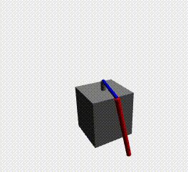
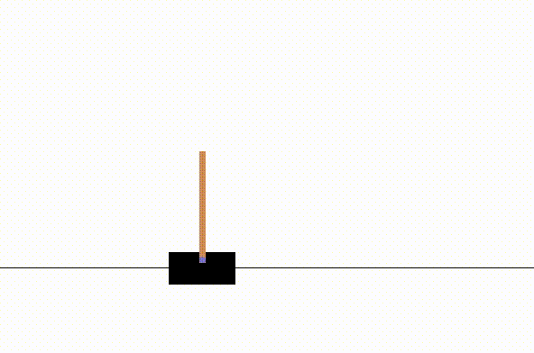

# Implementation of PPO and RandomSearch

## Requirements
This implementation requires python3 (>=3.5). 

## Virtual environment and installation
We reccomend to create a virtual environment for 
an easy installation of the dependencies: 

```
pip install virtualenv
```

Create a new conda environment with:

```
conda create -n env_name python=3.6.7
```

Activate the environment and install the project 
dependencies that are located in the requirements.txt 
file:

```
conda activate env_name
pip3 install -r requirements.txt

```
## Testing the installation
To check if the installation worked, 
try one of the examples that are located in [examples](examples)
using the code below:
 
``` 
python3 examples/ppo/cartpole_swing_up/execute_model.py
```

## Training the models
The algorthims are used as follows:

```
python <algorithm>_runner.py --env=Qube-v0  [additional arguments]
```

### Example PPO learn furuta pendulum

```
python ppo_runner.py --env=Qube-v0 --ppoepochs=5 --training_steps=1000 --horzion=1024 --hneurons=[64, 64] --std=1.0 --minibatches=32 --lam=0.97 --gamma=0.95 --cliprange=0.2 --vfc=0.5 --lr=1e-3 
```

### Example RS learn cartpole swing up

```
python rs_runner.py --env=CartpoleSwingShort-v0 --alg=ars_v2 --ndeltas=8 --training_steps=100 --lr=0.015 --bbest=4 --horizon=1024 --snoise=0.025

```

## Saving, loading
Every implementation has its own model handler that enables the features to save and load 
models. 

## Benchmark trained models
The following code is an example execution to benchmark PPO on 
Qube-v0 ten times. The benchmarking will be visualized. A model path has to be 
provided to load a model.  
```
python3 ppo_runner.py --env=Qube-v0 --path=<model_path> --benchmark=True --vis=True --benchsteps=10
```

## Troubleshooting
If numpy causes trouble, run the uninstall command multiple times until
no more version is located in your environment. Install numpy again
with ``pip3 install numpy==1.16.0``

## Example PPO best policy visualizations






## Developers
* Thomas Lautenschläger
* Jan Rathjens
